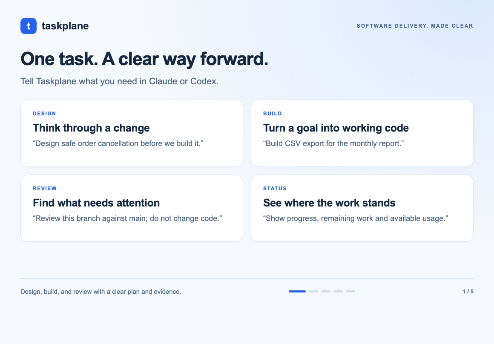

# taskplane

[](https://github.com/vdemkiv/taskPlane/actions/workflows/ci.yml)

**Design, build, and review AI-generated software with evidence, not trust.** taskplane
is the AI software-delivery control plane for people who ship and review code
with Claude or Codex every day. You ask it to design, build, review, or show status;
behind that simple request it checks whether the work is ready, keeps every
agent inside an approved scope, and requires current implementation, test, and
review evidence before anything can be called done.



taskplane is not another prompt collection, review bot, or project tracker. It
is the governed execution and assurance layer between your intent and
agent-generated changes. Requirements, dependencies, contracts, implementation,
and review stay connected from Definition of Ready through Definition of Done.
A complete 26-lens disposition makes architecture, solution design, security,
data, operability, UX, and other technical consequences explicit for engineers,
EMs, PMs, and nontechnical decision-makers. Only evidence-selected
`execute_deep` and `execute_light` rows dispatch; every remaining lens is
disclosed as evidenced `covered_by` or `not_applicable` rather than silently
omitted. Normal delivery is quick-only.

**Simple for the user; strict for the agents.** State the goal, review the
evidence, and make only the decisions that require human judgment. taskplane
keeps the machinery — scoped contracts, dependency depth, independent
submissions, lifecycle gates, durable memory, and the live dashboard — behind
that interaction without weakening it.

## Four prompts are enough

> **taskplane design:** design safe order cancellation before we build it

> **taskplane build:** add CSV export to the monthly report

> **taskplane review:** review this branch against main; do not change code

> **taskplane status**

The `taskplane` skill routes those requests to the existing product, design,
build, engineering, status, and orchestration skills. You do not need to choose a
persona, remember loop commands, select review lenses, or set dependency
depth. taskplane reports a concise text summary after each material
transition and shows the richer dashboard when the host supports it.

### Ten flows, one control plane

| Flow | Problem it solves | Evidence-backed outcome |
| --- | --- | --- |
| `taskplane` | Users should not have to learn personas, graph depth, lens routing, or loop commands. | One goal routes to Design, Build, Review, or Status while the strict harness stays internal. |
| `tp-product` | Ambiguous ideas become code before acceptance, dependencies, and product risks are settled. | A complete requirement, Product DoR, review, and explicit sign-off trigger Build only when ready. |
| `tp-design` | Architecture and contract choices otherwise emerge implicitly during implementation. | Alternatives, graph overlay, trade-offs, rollout, and validation are sealed in an approved Design Contract. |
| `tp-build` | The first implementation wins while readiness, alternatives, and downstream impact stay implicit. | Product, Design, Plan, optional A/B selection, Evaluate, Review, sign-off, and Retro stay connected. |
| `tp-go` | Agents drift scope, skip graph work, or report partial execution as done. | Scoped workers submit evidence; independent gates advance stages; humans retain approval and sign-off. |
| `tp-engineering` | Broad reviews reread the same repository and still miss dependencies outside the diff. | One diff and graph blast radius route only applicable lenses into one canonical review and human decision. |
| `tp-status` | Long runs hide the active stage, dependency risk, open gate, and next owner. | Mission control joins workflow, requirements, debt, and graph state with one explicit action banner. |
| `tp-northstar` | A locally sound idea can still consume time without serving product direction. | An advisory check exposes leverage, reversibility, opportunity cost, coherence, and the sharpest tension. |
| `tp-help` | Setup mechanics and a large skill catalog delay the first governed result. | Readiness checks and a short mental model lead to one concrete next action. |
| `tp-tag` | Team-chat decisions lose context, ownership, evidence, and durable state. | The conversation drives a repository-persisted loop with attributed approvals, dashboards, and resumable memory. |

Together these flows reduce user complexity without reducing agent discipline:
one dependency graph, one canonical review context, selective lenses, enforced
contracts, independent evidence, and explicit human gates from idea to retro.

This simplicity does **not** reduce agent work. A worker may only submit a
result; it cannot advance its own stage. The orchestrator independently runs
the engine gate, which recomputes source and review-artifact fingerprints and
rejects missing, stale, out-of-scope, under-tested, or under-reviewed work.
Human Design approval (when used), plan approval, and final sign-off remain
explicit.

## What taskplane does

- **The governed Evaluate-Loop.** Product → optional Design → Plan pass their
  mechanical gates before one consolidated pre-implementation authorization →
  build → evaluate → fix (≤2) → engineering review → final human sign-off.
  Serial or parallel waves use one enforced contract per agent, and only the
  orchestrator invokes the state-transition gate. Separate human checkpoints
  remain only for named exceptional decisions such as A/B selection or material
  scope and authority changes.
  [docs/loop-design.md](docs/loop-design.md), [docs/authority-matrix.md](docs/authority-matrix.md).
- **Enforced contracts.** Every agent runs inside a contract — file scope, action
  budget, denied commands, read-only for reviewers — screened by the PreToolUse
  hook before each tool call. Literal scope overrides carry provenance: only the
  human-approved plan's `plan_minted` mark authorizes them, never a CLI flag. [docs/state-spec.md](docs/state-spec.md).
- **26 lenses with focused stage routing.** Product and Design execute the
  minimum-sufficient focused quick route; every non-trivial Plan executes
  exactly 3–4 quick lenses. Each routed Product, Design, and Plan stage records
  one evidenced disposition for all 26 lenses. Build, Fix, Evaluate, and final
  engineering review launch zero lens workers. Evaluate is only a direct
  evidence collector and judge: it creates no lens route, slots, workers,
  disposition ledger, lens verdict, retry/invalidation state, or expanded-route
  authority. This successor contract is D-0014, accepted by `human:vdemkiv`.
  [docs/routing-and-flows.md](docs/routing-and-flows.md).
- **Graph decomposition.** `tp graph scan --decompose` derives a component layer
  inside the dependency graph (directory convention + import cohesion + AST
  clustering; floors overridable via `components.yaml`) with fingerprint-cached
  per-component lens maps. Reviews re-evidence the union of touched components'
  proposals, `component_attribution` names which component proposed each routed
  lens, and incomplete routing evidence stops with zero dispatch. Same doc.
- **Governed flows.** The review wave and the execute/evaluate/fix waves each
  dispatch as one journaled, resumable Dynamic Workflow on Claude; the Task-dispatch
  path stays mandatory and byte-identical everywhere — it is the only Codex path —
  and every human gate stays reachable with workflows off (`TASKPLANE_WORKFLOWS`).
  On Codex, every brief carries a collision-safe native `task_name`, exact taskplane
  role marker and instructions, model tier, optional model, and tier-derived
  reasoning effort; execute waves register those identities before spawn so strict
  dispatch can reject a renamed, mis-routed, or partial handoff. Same doc.
- **The regression gate.** Each change is verified for actual regressions within its
  dependency-graph blast radius at the DoD gate: Tier 1 blocks a was-green-now-red
  test against the change's baseline; Tier 2 flags a changed enforcement/public
  entry point with no covering test. [docs/regression-gate-design.md](docs/regression-gate-design.md).
- **One measurable delivery receipt.** A closed candidate/run interval binds
  settings, CI, dashboard publication, cleanup, portfolio, token/session,
  worktree, and dispatch evidence by digest. Billing, host-observed usage, and
  cumulative archive bounds stay separate; nonzero owned leaks or unexplained
  hard-ceiling breaches refuse sign-off, and Plan-return churn is measured
  against its 21-return baseline and two-return target. Dashboard, Retro,
  Engineering, and release consume the same redacted receipt without recounting
  traces or DOM state. [docs/wave-metrics.md](docs/wave-metrics.md).
- **Audit cadence + router audits.** Every Nth review (`TASKPLANE_AUDIT_EVERY`) a
  full-catalog sweep diffs its findings against the routing; any finding from an
  `n/a`-routed lens is auto-filed as a router regression that blocks sign-off.
- **A knowledge base that compounds.** Requirements (refinement-scored, with
  dependencies and named contracts), decision records (ADRs with lifecycle and
  supersede chains), and tracked debt (`tp req debt`) persist in a plan-aware
  per-project store and are recalled by relevance at every step.
  [docs/requirements-core.md](docs/requirements-core.md), [docs/lenses-and-knowledge.md](docs/lenses-and-knowledge.md).
- **Dependency-graph DoR/DoD.** Requirements declare dependencies and the
  API/event/data/runtime contracts they provide, consume, or change; before plan
  approval the refreshed graph checks depth, boundaries, and every new module, and
  the DoD compares planned vs realized modules and rejects a stale graph fingerprint.

The moving parts: an enforcement kernel (contracts + lifecycle hook +
orchestrator-only gates + audit trace), the loop engine, the Design Contract phase,
a 26-lens catalog with complete dispositions and focused quick execution, the
requirements/decisions/debt knowledge base, a deterministic dependency graph with a zero-token blast-radius map,
and portable `cheap`/`standard`/`deep` model tiers routed per step, task, and lens —
mapped to models by env config, verifiable with `tp loop verify-dispatch`.

## What's new

Recent releases. [CHANGELOG.md](CHANGELOG.md) is the
authoritative, complete history — if the two ever disagree, the CHANGELOG wins.

> **Forward-repair status.** v2.17.20 remains released-incomplete and v2.17.21
> remains the historical source-integration boundary on `main`. The unreleased
> v2.17.22, v2.17.23, v2.17.24, v2.17.25, v2.17.26, and v2.18.0 candidates are superseded;
> v2.18.1 is the tagged local predecessor, and v2.18.2 through v2.18.10 are
> superseded unreleased candidates. The forward release candidate moves as v2.19.0,
> which is not
> released. Historical
> graph revision `2757822e` remains an attributed inherited limitation: no
> history rewrite, no re-release of v2.17.20, and no verifier weakening.
> Preparing, validating, or pushing v2.19.0 to an isolated PR branch is not a tag, upload,
> Marketplace publication, installation, or release claim; those actions
> retain separate human authority.

| Version | Highlights |
| --- | --- |
| **v2.19.0** | **Fresh-task native hook bootstrap and installable package repair — release candidate, not released.** Installed OpenAI hooks retain native SessionStart authority, onboarding accepts launcher-only package commands, and a fresh linked task records its first session receipt in the canonical default store before locator creation. Repository bridges, custom homes, ambiguity, and unrelated chats remain fail closed; the extracted-package journey exercises the real path end to end. |
| **v2.18.10** | **Fail-closed delivery authority and isolated global hooks — superseded unreleased candidate.** It completed canonical settings, native metering, evaluator quality evidence, dashboard-source validation, global-hook isolation, and package provenance, but installed-package onboarding still rejected launcher-only commands and a fresh native SessionStart could not record its receipt before locator creation. v2.19.0 closes both bootstrap edges. |
| **v2.18.9** | **Native telemetry, isolated pickups, and one current dashboard — release candidate, not released.** Native Codex counters now drive non-zero per-pickup budgets, terminal receipts, Retro, and dashboard metrics; null counters fail closed and resumed sessions are not double counted. Worker spawns enforce zero inherited turns, and the dashboard link now opens the full styled current document whose dependency graph is verified in a real browser. |
| **v2.18.8** | **Canonical terminal Plan graph fallback — superseded unreleased candidate.** It restored the terminal task DAG and truthful unverified waves, but native metering, zero-context spawn binding, and the exact surfaced dashboard document were not yet wired end to end. v2.18.9 closes those runtime edges. |
| **v2.18.7** | **Terminal dashboard and artifact wiring repair — superseded unreleased candidate.** It restored terminal Design visibility and migrated private artifact preservation, but a real terminal run with a drifted mutable Plan file still hid its canonical task DAG and waves. v2.18.8 closes that last projection edge. |
| **v2.18.6** | **Truthful legacy terminal migration — superseded unreleased candidate.** It could close an upgraded active run without changing task status or inventing execution, but its terminal dashboard dropped Design/Plan graphs, labeled the baseline as the delivered candidate, and failed to reuse the newly created private artifact manifest. v2.18.7 closes those presentation and preservation edges. |
| **v2.18.5** | **Full control-plane wiring — superseded unreleased candidate.** It connected dynamic Design transport, decomposition, failure classification, Build-quality admission, settings defaults, and durable artifact classes, but its new-run artifact binding could not close an already-active legacy run after upgrade. v2.18.6 adds that terminal-only migration before upload. |
| **v2.18.4** | **Dashboard execution-status repair — superseded unreleased candidate.** It corrected the Plan/live-status join, but the later whole-flow review found the dynamic Design transport, decomposition, classification, Build-quality, and durable artifact edges were still incomplete. v2.18.5 closes them before upload. |
| **v2.18.3** | **Canonical delivery settings, CI-first testing, and exact-owned cleanup — superseded unreleased candidate.** It delivered the new dashboard pipeline, but its final Plan graph replayed Plan-time pending task status after the governed loop had completed. v2.18.4 corrects that live-status edge without weakening approval receipts or freshness checks. |
| **v2.18.2** | **External-worktree Codex hook bootstrap repair — not released.** Hooks now resolve a validated repository launcher through Git's common directory when a linked worktree has no ignored local bridge, keep host-native checks on that same stable engine, fail with an actionable error when neither a launcher nor plugin root exists, and restore the launcher before any required hook-config rewrite. A local reinstall and generated upload artifact are development actions, not Marketplace publication or a public release. |
## Install

How you install taskplane depends on your **account type**, and the paths are
genuinely different — the most common one (an org member on a Team/Enterprise
plan) is also the most restricted. Start with the row that matches you. Install
facts are current per the Claude docs as of August 2026:
[Use plugins in Claude](https://support.claude.com/en/articles/13837440-use-plugins-in-claude)
and [Plugin marketplaces](https://code.claude.com/docs/en/plugin-marketplaces).

### I'm on a Team or Enterprise account (not an org admin)

Honest first: **you cannot add taskplane from GitHub yourself.** On
Team/Enterprise accounts, plugins come from your organization's plugin catalog
(Customize → Plugins), which your org's owners curate; the personal
add-a-marketplace path is not available to you, and on Enterprise your admin may
restrict the catalog further (in Claude Code, managed settings can likewise block
marketplace adds — see [managed marketplace restrictions](https://code.claude.com/docs/en/plugin-marketplaces#managed-marketplace-restrictions)).

Your two real paths:

1. **Ask an org admin to publish taskplane** to your organization's marketplace —
   send them the [exact admin steps](#im-an-org-admin-teamenterprise) below. Once
   published, taskplane appears in your org plugin catalog and you install it from
   there in one click.
2. **File upload, where your org allows it:** download this repository as a ZIP
   from GitHub (**Code → Download ZIP**), then in Claude (Customize → Plugins)
   upload it as a custom plugin file. If no upload option is shown, your org has
   disabled personal plugin uploads — path 1 is the way.

Fallback: taskplane also works on a **personal Pro or Max account** with the
direct GitHub path below, if you want to evaluate it before asking your admin.

### I'm an org admin (Team/Enterprise)

Publish taskplane to your organization's marketplace from **Organization
settings → Plugins** (admin guide: [Manage plugins for your organization](https://support.claude.com/en/articles/13837433-manage-plugins-for-your-organization)):

- **Upload a file:** Add plugins → *Upload a file* → name the marketplace → drag
  in the plugin file (under 50 MB) → Upload. Re-uploading under the same name
  overwrites the previous version.
- **GitHub sync:** organization sync only reads **private or internal**
  repositories (through the Claude GitHub App), so mirror `vdemkiv/taskPlane`
  into a private repository in your org first, then connect it in `owner/repo`
  form. The initial sync runs automatically; toggle *Sync automatically* to pick
  up merged version bumps, or use *Update* for manual syncs.

Then set availability per plugin: **Installed by default**, **Available for
install** (listed in the catalog), **Required** (installed for everyone, not
removable), or **Not available**. Changes reach members on their next session or
plugin refresh. For org-managed Claude Code machines, allowlist the marketplace
via `strictKnownMarketplaces` / `extraKnownMarketplaces` in managed settings so
members' installs resolve without a blocked marketplace add
([settings reference](https://code.claude.com/docs/en/settings)).

### Personal, Pro, or Max account

The direct GitHub marketplace path works as-is. **Claude Desktop or claude.ai
(Chat / Cowork):** Customize → Plugins → **+** in *Personal plugins* →
**Add marketplace** → **"Add from a repository"** → paste
`https://github.com/vdemkiv/taskPlane` → *taskplane* appears → **Install**.

**Claude Code (terminal)** — same thing; the first command adds this repo as the source:

```
/plugin marketplace add vdemkiv/taskPlane
/plugin install taskplane@taskplane-marketplace
/reload-plugins
```

### Codex (OpenAI)

**Recommended — published plugin directory:** in the ChatGPT desktop app,
select **Codex**, open **Plugins**, search for **taskplane**, choose **+** to
install it, then start a new Codex task in your repository. In Codex CLI, run
`codex`, open `/plugins`, install/enable **taskplane** from the marketplace tab,
and start a new CLI session. Newly installed skills load in new tasks/sessions.

Plugins are supported in ChatGPT desktop Codex and Codex CLI, not the Codex IDE
extension. See [Codex plugins](https://developers.openai.com/codex/plugins).

**GitHub source — development or catalog fallback:**

```bash
codex plugin marketplace add vdemkiv/taskPlane
codex plugin add taskplane
codex
# inside Codex: /plugins, verify taskplane is enabled, then start a new session
```

On first repository setup, taskplane installs a portable repo-local
`.codex/hooks.json` and an ignored machine-local bridge, then asks you to start
one more task so Codex loads the lifecycle hooks. After that first load, the
bridge resolves the newest valid installed taskplane engine on every call, so
plugin version updates do not require a Codex restart for hook execution.
Codex still loads newly changed skill or MCP definitions at a task boundary.
Repository URLs, refs, and pull requests do not require opening a new task:
taskplane acquires them into a managed checkout, inherits the current host
session, and prompts in the same chat when GitHub authentication, a tool, or
storage authorization is needed.
Keep Codex's sandbox and approval controls enabled — taskplane's scope contract
is an additional guardrail, not a replacement.

Requires `git` in your workspace (the gates need a commit snapshot) and
**CPython 3.10 or newer** (standard library only; `python3` on macOS/Linux or
the `py` launcher on Windows). The validated range is CPython 3.10–3.13; see
[docs/configuration.md](docs/configuration.md#supported-python-runtime). Nothing
else to set up.

## Quickstarts

Command-first, one per host. Each ends the same way: say **"set up taskplane"**
and onboarding takes it from there.

### Quickstart: Claude Code (terminal)

```
# personal accounts (org members: install from your org's plugin catalog instead)
/plugin marketplace add vdemkiv/taskPlane
/plugin install taskplane@taskplane-marketplace
/reload-plugins
```

Open your project repository (it needs a git commit), then say **"set up taskplane"**.

### Quickstart: Cowork / Claude Desktop

1. Install taskplane by your account path above — org plugin catalog on
   Team/Enterprise, *Personal plugins → Add marketplace* on personal accounts.
2. Connect the folder / repository you want governed (Cowork: attach the folder).
3. Say **"set up taskplane"**.

### Quickstart: Codex

```bash
codex
# inside Codex: /plugins → find taskplane → install and enable
# then start a NEW CLI session
```

`cd` to your project repository first (desktop: open it as a local environment),
then in the new task say **"set up taskplane"**. Use the GitHub source commands
in the Install section only for local development or when the published catalog
is unavailable.

You can also start from a repository URL or pull request. Say what you want to
build or review; taskplane runs its repository precondition automatically,
keeps source under the managed checkout root (never under `.em-review`), and
continues in this task. A recoverable auth/tool/storage requirement appears as
one approval prompt rather than a failed review or terminal handoff.

## Onboarding — the short version

Say **"set up taskplane"**, or just state a goal — `taskplane` routes it and runs
onboarding for you on a fresh folder. `tp onboard` won't hand you to a governed run
until three checks are green: a real project folder to work in (an empty scratch
dir or the session root is refused), a git commit to diff against (the gates fail
closed without a snapshot), and `tp init` — which scaffolds the four context docs,
scans the dependency graph, and creates the knowledge base. On a brownfield
project, fill `current-state.md` first: it grounds every design review in as-built
reality, and reinventing an existing component is a blocker-class finding.
Onboarding then asks one question — keep taskplane knowledge private/local
(`personal`, `~/.taskplane/projects/<repository-key>/knowledge`) or shared
in-repo (`team`/`enterprise`, `.taskplane-kb/knowledge`) — and reports the
resolved model-tier map. Source checkout, private run state, graph/evidence,
and artifacts use separate roots under `~/.taskplane`; see
[repository preconditions and hybrid storage](docs/storage-and-repositories.md).
Claude Code users
reload plugins after installation; Chat/Cowork and Codex users start a new
conversation/task only for the host's initial plugin/hook load. Managed
checkouts and later plugin patch versions continue in the same task. Full Claude
and Codex onboarding, sharing modes (`tp share`), model tiers, cost routing, and
context storage: [docs/onboarding.md](docs/onboarding.md).

## Honest about what the guardrails are

The scope/command guardrails are a real, mechanical help for the everyday failure —
an agent that drifts out of its lane or fires a destructive command by mistake. For
matched mutating tool routes the host exposes to plugin hooks, the PreToolUse screen
checks scope, denied commands, and the action budget **before** the call, resolves
`..`/absolute/symlink paths, treats destructive programs (`rm`, `chmod`, …) as
writes, and fails **closed** on a corrupt contract or screening error. Codex
subagent lifecycle hooks are deliberately advisory; optional
`TASKPLANE_ENFORCE_DISPATCH=strict` additionally fails closed unless a native spawn
matches an emitted task name, role marker, model, and reasoning effort. This is
keep-the-agent-on-topic, not a security sandbox: plugin hooks do not intercept tool
routes the host does not expose, arbitrary effects performed inside an allowed
process, or remote side effects. A task that grants `Bash` grants arbitrary code
execution, and no string-screen can fully contain a *determined adversary* — for a
hard boundary, keep Codex/Claude approvals and sandboxing enabled and add OS-level
isolation where needed (the token/$ budget is cooperative in the same way).
Likewise, "a worker cannot advance its own stage" is a
**protocol + audit** guarantee, not process isolation. What holds mechanically is
the **evidence**: a gate only advances on a submission whose fingerprints (changed
source plus the exact evaluator/engineering evidence bytes) still match the
workspace, so even a worker invoking the gate itself cannot pass unproven, stale,
or post-submission-edited work.

## Layout

```
taskplane/
├── taskplane/              # the enforcement core (kernel + hook screener)
├── hooks/hooks.json        # PreToolUse → taskplane screen
├── agents/                 # product/designer/planner/executor/evaluator/fixer/engineering/orchestrator + tp-lens + tp-northstar
├── skills/                 # taskplane façade + tp-go/product/design/build/engineering/northstar/tag/status/help
├── lenses/                 # the 26-lens catalog
├── scripts/                # generators (e.g. the lens-catalog doc)
├── discipline/             # TDD, debugging, worktrees — the operating disciplines
├── docs/                   # state spec + design notes + feature deep-dives
# note: the knowledge base is NOT here — personal plans keep it in ~/.taskplane/projects/<key>/; Team/Enterprise keeps it in-repo at .taskplane-kb/
├── PRIVACY.md              # privacy policy (local-only, no telemetry)
└── LICENSE                 # Apache License 2.0
```

## Going deeper

- [docs/cli-reference.md](docs/cli-reference.md) — the complete generated command,
  positional-argument, and flag reference.
- [docs/specialist-routes.md](docs/specialist-routes.md) — the specialist skill
  routes (`tp-design`, `tp-engineering`, `tp-build`, `tp-go`, `tp-product`,
  `tp-northstar`, `tp-status`, `tp-help`), what you'll see during a governed run,
  and the CLI under the hood. Definition and judgment stay separate seats — the
  grader never grades their own spec.
- [docs/onboarding.md](docs/onboarding.md) — the full setup reference.
- [docs/claude-tag.md](docs/claude-tag.md) — taskplane as your org's @Claude in
  Slack channels via Claude Tag (beta), with the `tp-tag` skill.
- [docs/routing-and-flows.md](docs/routing-and-flows.md) — routing v2, component
  decomposition, the review and stage waves with their mandatory byte-identical
  Task fallback, the audit cadence, and Evaluate's direct-evidence judgment —
  each with a dogfood example from this repository.
- [docs/configuration.md](docs/configuration.md) — every environment variable.
- [docs/loop-design.md](docs/loop-design.md) · [docs/authority-matrix.md](docs/authority-matrix.md) ·
  [docs/state-spec.md](docs/state-spec.md) — engine design, who may do what at
  every step, and the on-disk state.

**License:** free and open source under the **Apache License 2.0** — use it
personally or at work, commercially or not, no strings. See `LICENSE`.
**Privacy:** taskplane runs locally, collects nothing, and sends nothing — no
telemetry, no accounts, no network calls of its own; all state stays on your disk,
in an external store (`~/.taskplane`, personal plan) or in-repo (`.taskplane-kb/`,
Team/Enterprise). See `PRIVACY.md`.
