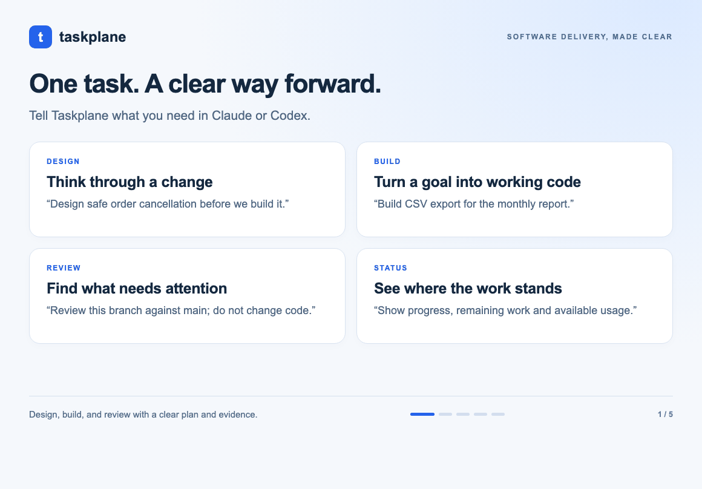

# Taskplane

**Plan, build and review software with Claude Code or Codex, keeping decisions and verification connected.**

Taskplane is a plugin for coding agents. It connects your requirements, source dependencies, tasks, implementation, tests and review findings in one project-local workflow and dashboard. Use it for a complete delivery, a standalone design or code review, or a reusable workflow you can run with new inputs.

Current version: **2.33.3**. Fresh Claude acceptance testing for this version remains external and pending. Local tests and package checks do not establish that an installed host can complete the same work. See the [candidate test guide](docs/test-candidate.md).



## Choose the work

Describe the outcome in your chat; the agent handles Taskplane's commands and state.

| What you need | Example request |
| --- | --- |
| Define the outcome | `taskplane define the scope and acceptance criteria for CSV export` |
| Design a change | `taskplane design safe order cancellation before we build it` |
| Build a feature | `taskplane build CSV export for the monthly report` |
| Review code | `taskplane review this branch against main; do not change code` |
| Create a reusable workflow | `taskplane create a reusable change risk review with security and code-quality reviewers; save it without running it` |
| Check progress | `taskplane status` |

Use `taskplane help` for the available routes. Help and status inspect existing state without starting a run. Product, Design and Engineering can run on their own; a review request does not authorize code changes.

## Install and run your first task

You need **Python 3.10+**, **Git**, a local project folder and a Claude Code or Codex host with plugin support. Your host or organization must allow the plugin and its hooks. Check Python with `python3 --version` on macOS/Linux or `py -3 --version` on Windows.

### Codex

1. Open **Plugins** in the desktop app, or `/plugins` in Codex CLI.
2. Install and enable **taskplane** from your permitted marketplace.
3. Review and trust its hook definitions. Codex CLI exposes this under `/hooks`; desktop controls depend on the host version. Changed hook definitions need renewed review.
4. Start a new chat in the intended project so the installed skills load.

For a configured CLI marketplace, use `codex plugin list` to find the entry and `codex plugin add taskplane@MARKETPLACE` to install it. Managed installations use the organization's catalog.

### Claude Code

Where adding a marketplace is permitted:

```text
/plugin marketplace add vdemkiv/taskPlane
/plugin install taskplane@taskplane-marketplace
```

Follow the host's activation or reload instructions. Check `/plugin` for loading errors, inspect `/hooks`, and respond to the project's trust and permission prompts. Managed installations use the organization's catalog.

### Verify an update

Check the runtime actually loaded by the host:

```sh
python3 /actual/plugin/taskplane/tp.py version --verify
```

Both manifests should agree on `2.33.3`. A source checkout, an archive and an installed plugin cache are separate copies. Updating one does not update an already running session. Keep loaded skills and hooks on the same installation; reload or start a fresh chat after an update. See [onboarding and troubleshooting](docs/onboarding.md).

### Try a small real change

Open your repository and ask:

```text
taskplane build a CSV export for the monthly report.
First show me the proposed scope, acceptance criteria and Taskplane dashboard.
```

Review the proposed outcome and dashboard, then approve or request changes. Continue in the same chat so the run, decisions and evidence stay connected. If setup is blocked, Taskplane should identify the missing capability or permission and preserve the requested work.

## How delivery works

A full delivery follows **Product → Design → Plan → Build → Evaluate → Engineering → Retro**.

| Phase | Result |
| --- | --- |
| Product | Outcome, scope and observable acceptance criteria. |
| Design | Approach, trade-offs, dependencies and validation strategy. |
| Plan | Ordered tasks, ownership, permitted changes and required checks. |
| Build | Implementation and recorded verification results. |
| Evaluate | Evidence showing whether each acceptance criterion is met. |
| Engineering | Independent reviews of the relevant correctness, security and maintenance risks. |
| Retro | Delivery summary, lessons and explicit remaining work. |

Each phase submits a concrete result for acceptance before the next phase starts. Manual approval is the default. Accepted decisions, failed checks and requested changes remain in the run's history.

The coordinating agent assigns useful independent work to native host workers. Each receives scoped files and required context; dependent tasks wait for verified results. Concurrency follows observed host capacity. A required worker that cannot start or complete remains incomplete and is reported as such.

### Working autonomously

Authorize automatic phase approvals with explicit boundaries:

```text
taskplane build CSV export for the monthly report.
For this run, auto-approve phases after the required checks pass.
Keep the existing report format and permissions. Pause on a failed check,
uncertain result or scope change. Stop before Retro for my review.
```

The dashboard records the policy and permitted phases. Automatic approval still requires the phase evidence and your conditions to pass. Say **"Return to manual approval"** to take back checkpoint decisions. Phase approval does not grant separate host tool permissions or authorize a scope change.

## Reuse a workflow

Workflow Builder saves repeatable work as a versioned JSON definition in the project. Packaged seeds cover a **change risk review**, **design brief** and **full feature delivery**.

```text
taskplane create a reusable change risk review with separate security and
code-quality reviewers and one combined report. Save it without running it.

taskplane preview that workflow for this branch against main.

taskplane run the saved workflow with these inputs.
```

Authoring uses a Design checkpoint. Saving and previewing do not execute the workflow. An authorized invocation binds fresh inputs and outputs, then uses Taskplane's existing phases, workers, decisions and dashboard. A saved definition carries no approval for future runs. See the [Workflow Builder guide](docs/workflow-builder.md) for inputs, commands and current limits.

## Follow progress and handle interruptions

The dashboard at `.taskplane/dashboard.html` shows the goal, phase, task dependencies, source graph, findings, checks and available token usage. It is a generated snapshot: refresh it after regeneration and check that its project and run match the work you are following. Missing measurements remain unknown.

Ask `taskplane status` for the current owner, completed work and next action. Resume an interrupted run through its original session and supported recovery controls. Preserve failed attempts and incomplete checkpoints; a retry needs a changed condition, not repeated execution of the same blocked command. See [continuation and recovery](docs/cli-reference.md#native-session-continuation).

## Host support and limits

- **Codex:** plugin and hook availability depend on the installed host. Verify the loaded runtime and actual hook activity after installation.
- **Claude Code:** the claim and context transport supports macOS and Linux. Required Claude context operations refuse on Windows. Fresh live acceptance of the 2.33.3 candidate remains pending; see [external tests](docs/test-candidate.md) and [worker recovery](docs/claude-worker-recovery.md).
- **Cowork:** requires an explicit selected-project binding and separate observations of command and worker execution. A connected folder alone does not prove local execution. Live Cowork certification remains unavailable; see [Cowork setup](docs/onboarding.md#cowork-workspace-and-execution).

Taskplane's ordinary workflow controls use observed host events and local state. They do not provide an OS sandbox or host-wide protection. Normal host permissions remain in effect. Unit tests, extracted-package checks and native installed-host acceptance are separate evidence.

## Development and packages

From the source checkout, create a virtual environment and install the pinned dependencies in `requirements-dev.lock`.

```sh
python3 -m pip install --require-hashes --no-deps -r requirements-dev.lock
python3 scripts/ci_local.py --check quality
python3 scripts/ci_local.py --check tests --suite all
python3 scripts/ci_local.py --check browser
python3 scripts/package_claude.py
python3 scripts/package_openai.py
```

The browser check needs Chrome or Chromium. `python3 scripts/ci_local.py` runs tests, quality checks and packaging; add `--browser` for browser coverage.

Routine CI runs Linux and Windows regression, native and archive checks in parallel. The full 8 MiB storage stress fixture runs weekly and on demand; the local `all` suite includes it. See [CI coverage and performance](docs/ci-performance.md) for suite ownership and release checks.

Packages are written to `dist/taskplane-2.33.3.plugin` for Claude and `dist/taskplane-2.33.3-openai.zip` for Codex. Each JSON sidecar records the source commit, working-tree status, archive hash and member hashes. Building a package does not install or publish it. Follow the [candidate test guide](docs/test-candidate.md) to load and validate those exact bytes.

## Documentation

- [Onboarding, updates and troubleshooting](docs/onboarding.md)
- [CLI reference](docs/cli-reference.md)
- [Workflow Builder](docs/workflow-builder.md)
- [Candidate packages and external tests](docs/test-candidate.md)
- [Claude interactive recovery](docs/claude-interactive-recovery.md)
- [Engineering review lenses](docs/lens-catalog.md)
- [Release history](CHANGELOG.md)
- [Privacy](PRIVACY.md) · [Terms](TERMS.md) · [Apache-2.0 license](LICENSE)
