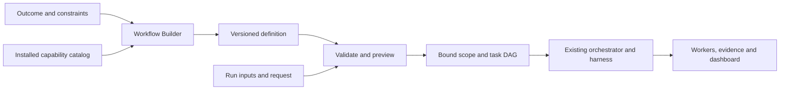

# Workflow Builder — working design v0.1

Status: **proposal for discussion; no implementation**. Prepared 2026-10-01.

The user asked for an agent that builds workflows by reusing Taskplane functionality and its harness, with ideation before building. The clarified direction is **both Taskplane workflows and business automations, starting with Taskplane workflows**.

## Proposed product

Add **Workflow Builder**, a specialist authoring role tentatively named `tp-workflow-builder`, reached through “Taskplane, create a workflow for …”.

It turns a desired outcome into a reusable, inspectable workflow definition. It chooses existing capabilities, asks for material missing inputs, assembles dependencies and outputs, explains checkpoints, and produces a preview. The existing orchestrator and harness execute a bound instance.

A useful first promise:

> Describe a repeatable way of working once. Inspect what it will read, produce and require from you. Reuse it for the next change with fresh inputs and evidence.

When dispatched as a scoped worker, the builder only returns definition artifacts; it cannot start another run, dispatch children, or operate root controls. A root authoring skill may guide the conversation and hand the result to the orchestrator.

The builder adds authoring and reuse. The planner still decomposes a particular delivery; the orchestrator still controls its run; specialist workers still do bounded work.

## First experience

Example request: “Create a change-review workflow with security and code-quality reviews, then give me one report. Never edit the source.”

1. **Understand.** Establish the desired result, required review criteria and inputs. Reuse the selected repository. Ask only for consequential gaps.
2. **Compose.** Select the standalone Engineering route, the existing lens role twice, and root synthesis. Show two independent reviews feeding one report.
3. **Preview.** Show required inputs, exact resolved reads and writes, dependencies, worker requirements, failure behavior and the final checkpoint. Label unresolved inputs and unsupported capabilities.
4. **Save.** Save a reusable definition and plain-language summary. Saving does not start a review.
5. **Run on request.** “Run Change risk review on this branch against main” binds the definition to that checkout and immutable refs, creates a fresh run and uses the existing dashboard.

“Create and run” can authorize both steps in one request; no redundant launch confirmation is needed once the proposed action is concrete and within that request. Existing phase acceptance and host permissions still apply.

Illustrative preview:

| Item | What the user sees |
|---|---|
| Inputs | Selected repository, base/head, review criteria, relevant source/dependencies/tests |
| Work | Security review and code-quality review; synthesize after both return |
| Output | One report with findings, source evidence, criterion coverage and unknowns |
| Writes | Only the expanded review-output paths |
| Stop | Missing required capability, failed evidence, scope change, or final checkpoint |
| Reuse | Run the same definition with a different bound change |

See [the example definition](workflow-builder-example.v0.1.json). It is proposed data, **not an executable feature or a format supported by the current CLI**.

## Architecture and reuse

Two different graphs remain visible: a workflow's task dependencies describe execution order; the repository's source dependency graph informs what must be inspected. Neither replaces the other.

| Concern | Reuse now | Addition proposed for v0.1 |
|---|---|---|
| Roles | Product, designer, planner, executor, evaluator, engineering and lens roles | A builder role and authoring entry point |
| Phase lifecycle | Existing standalone and full-delivery routes | A compiler that selects one supported route |
| Work decomposition | Typed task DAG, ownership, criteria and verification | Parameterized task templates and input/output bindings |
| Execution | Native prepare/claim/context/join/accept-result protocol | Adapter from a bound template to existing commands |
| Authority | Scope, actual user request, phase checkpoints, run-bound policy | Explain requested effects in preview; never store reusable approval |
| Evidence | Phase packets, source fingerprints, findings and context receipts | Bind definition digest, compiler version and capability resolution to run evidence |
| Visibility | Native Taskplane dashboard | Display definition name/version and bound parameters in the existing view |
| Persistence | Existing run state and recovery | Version-controlled definition files, separate from run state |

Current source fixes the phase names and routes in `taskplane/workflow.py:10`, `:68` and `:226`. Full delivery starts at Product; standalone entry is Product, Design or Engineering. Arbitrary stage names or skipped gates are therefore outside the first version.

Task DAG validation, exact paths, criteria, execution typing and freezing already exist in `taskplane/workflow_evidence.py:110`, `:136` and `:226`. Worker preparation and result freshness live in `taskplane/worker_runtime.py:227` and `:548`. Earlier accepted phase packets can satisfy dependencies (`:96` and `:128`). The compiler should preserve these contracts rather than reproduce their state machine.

The installed plugin and checkout differ. Capability resolution must identify the **actually loaded runtime**, supported contract versions, role/lens files and relevant fingerprints. A version label or old documentation alone is insufficient. In particular, the installed runtime has typed Plan/Build verification requirements beyond the checkout's older text-based strategy. Full-delivery support must compile those actual check contracts, including evidence outputs and input fingerprints. Historical Dynamic Workflow transport descriptions are not evidence that those files or commands exist in this checkout.

## Definition contract

Use JSON first, following the existing harness's data contracts. An optional YAML authoring view can follow after one canonical format works. Proposed storage is `workflows/<name>.workflow.json`, committed with the project; run state remains under the existing Taskplane store.

A definition contains:

- **Identity:** schema version, stable ID, human name, immutable published version and description.
- **Route:** existing full-delivery route or one allowed standalone phase.
- **Inputs:** typed parameters, required/default rules and safe binding expressions.
- **Tasks:** stable ID, phase, registered capability, instructions constrained by the capability, dependencies, read bindings, named output files, criteria mapping and verification.
- **Requested policy:** manual by default; source/external effects and failure handling. This is a request, not authorization.
- **Acceptance scenarios:** observable success and failure cases for the workflow itself.

For v0.1, capability IDs are a small explicit registry over installed Taskplane roles and lenses. Each entry defines supported phases, input/output schema, effect class, native-worker requirements and implementation identity. User text or a Markdown role name cannot register executable capability.

Bindings resolve parameters and named artifact references only; they cannot execute code or interpolate a shell command. Unknown fields that could affect execution are rejected. Each output expands to an exact workspace-relative file before admission. The compiler also declares exact paths for its own scope/task/packet artifacts and fills all seven phase scope keys, including empty lists for unused phases.

The preview uses symbolic refs to make reuse clear. The executable instance must contain no unresolved symbols.

## Definition versus execution

Keep two independent records:

| Definition | Bound run |
|---|---|
| ID, version, schema and content digest | Fresh run/visit IDs and current revision |
| Reusable parameters and task templates | Immutable input refs, exact paths and resolved criteria |
| Requested capabilities and policy defaults | Observed available capabilities and actual user authority |
| Draft / valid / superseded authoring status | Existing working / checkpoint / decision / completion state |
| No worker identities or approvals | Fresh grants, real workers, receipts and checkpoint decisions |

A template edit creates a new version. An active run stays pinned to its original bytes and compiler/runtime binding. Editing the file cannot modify an active task plan. Existing scope-change or repair controls govern any in-flight change.

For full delivery, the template provides phase/task patterns. The actual Build write scope and task definitions are finalized by Plan and accepted through the existing checkpoint. A saved template cannot pre-approve unknown implementation paths or future outputs.

If another run occupies the selected workspace, report the active run and use supported continuation or separately authorized lifecycle controls. Never silently replace it.

## Validation and execution boundary

The compiler should be deterministic for the same canonical definition, resolved inputs, capability manifest and compiler version. It should emit:

1. A readable preview with unresolved values and diagnostic locations.
2. The exact scope, shared task DAG and criterion map accepted by current interfaces.
3. A compilation record with digests and a task-template-to-runtime-task mapping.

Validation has two levels. **Static validation** checks schema, route, references, cycles, phase ordering, criterion coverage, capability types and overlapping effects. **Binding validation** checks the selected workspace, immutable refs, actual runtime support, exact read/write paths, required native dispatch, context size and current inputs.

The compiler calls existing validators for their actual contracts. Native worker availability and grants remain runtime observations. A successful preview does not claim that workers ran or tests passed.

Execution follows the existing root-owned protocol. After the first useful worker establishes readiness, release remaining independent work up to observed capacity. Join and verify results before satisfying dependencies. A required native task cannot silently become root work. Worker failures and unknown statuses remain visible.

Preview is free of task execution, remote mutations and workflow-start side effects. It may read authorized local source and write the explicitly requested preview/definition artifacts.

## Failure and recovery

| Condition | Behavior |
|---|---|
| Missing input, capability or unsupported route | Keep a draft and return the smallest actionable diagnostic; launch nothing |
| Cycle, dangling reference or uncovered criterion | Reject compilation with the affected task/field |
| Conflicting writes or read/write overlap | Require an explicit dependency or disjoint output assignment |
| Worker failure or missing join evidence | Preserve evidence and block downstream tasks |
| Input/source/runtime drift | Revalidate; issue fresh context/grants where required; never transfer old approvals |
| User changes a saved definition | Create a new version; existing runs stay pinned |
| User changes active scope | Use existing amendment/repair rules and renew affected acceptance |
| Interrupted authoring | Resume the saved draft |
| Interrupted execution | Resume the existing run and inspect actual state; do not create a duplicate |

Allow only a bounded explicit retry with the observed reason. Autonomous retry loops, arbitrary branching and subworkflows are deferred.

## Scope and alternatives

**Recommended v0.1: a definition compiler over the existing harness.** Support manual invocation; create/edit/save/validate/preview/run; existing routes; sequential and independent parallel tasks; exact file/artifact bindings; native status; and version pinning.

Seed templates should exercise different uses: change-risk review (standalone Engineering), design brief (standalone Design), and feature delivery (all seven phases). The change-risk review is the first vertical slice.

| Approach | Benefit | Cost / decision |
|---|---|---|
| Prompt-only builder | Fast ideation with little runtime work | Weak validation, repeatability and compatibility; useful as today's sketch |
| Definition compiler over existing routes | Reuses execution and evidence, gives repeatable reviewable output | Constrained route vocabulary; recommended first build |
| General workflow engine immediately | Arbitrary business steps, branching and triggers | Requires new route/action/recovery semantics before value is proven; defer |

Excluded from v0.1: arbitrary phase sequences, generated executable plugins, webhooks/schedules, remote writes, credentials in definitions, workflow marketplace, nested workflows, visual drag-and-drop editing and claims of host-wide enforcement.

## Path to business automations

Preserve typed inputs, capabilities, outputs and evidence so the authoring model can grow. Do not force business steps into software-delivery phase names.

A later release needs an explicit route/profile extension and connector action contract. Each external capability must identify its input/output schemas, account/resource binding, read versus write effects, authorization requirements, preview behavior, timeout/retry semantics and observable result.

Start with **read → transform → draft**. Add **approve → act** only after external effect handling is designed and verified. Example: collect account updates, draft follow-ups, show recipients and message bodies, then send under explicit authorization. A workflow-definition review is not permission to send.

Credentials remain in the host's connector/secret system; definitions contain references. External action identity and idempotency keys must survive restart. After an ambiguous timeout, reconcile whether the action occurred before retrying; do not claim exactly-once delivery when the provider cannot establish it. Compensating actions require their own defined scope. Triggers, scheduling, concurrency control and rate limits come after reliable manual execution.

These are extension requirements, not claims about connectors currently installed.

## Acceptance and proposed build sequence

| Criterion | Scenario / evidence expected during the future build |
|---|---|
| WB1 — useful authoring | A natural-language change-review request produces a comprehensible preview and definition; a second invocation uses new inputs without re-authoring |
| WB2 — genuine reuse | Compiled instances use existing scope/task validators, native worker protocol, phase output, context and dashboard; no second approval engine |
| WB3 — bounded execution | Cycles, missing capabilities, path escapes, effect conflicts and stale bindings fail before dispatch; template changes cannot alter a running instance |
| WB4 — scoped first release | Existing routes execute; arbitrary stages and external writes return explicit unsupported diagnostics |
| WB5 — verified outcome | Independent workers join and produce source-backed findings; interrupted/stale cases preserve unknowns; a fresh run requires fresh authority |

Suggested implementation order for a later authorized build:

1. Capability manifest and versioned definition contract; parser and static validator.
2. Binder/compiler and pure preview, with golden examples and negative cases.
3. Orchestrator integration for standalone Engineering; reuse one native dashboard.
4. Live end-to-end change-review workflow, interruption/resume and runtime-drift checks.
5. Broaden to standalone Design/Product and full delivery; add authoring skill/agent and user documentation.

Source graph inspection found 67 components. The relevant seams are `taskplane::workflow`, `taskplane::context_handoff` (including evidence validation), and `taskplane::core` (flow and worker execution). The bounded impact query reported 23 impacted modules and depth truncation, so it is an impact guide, not a complete change inventory. Proposed new compiler/catalog modules should depend on existing contracts. Avoid changing the core phase state machine in v0.1.

## Questions to refine after this draft

The main recommendation is ready for discussion: adopt a conversational builder plus a versioned definition/compiler, use change-risk review as the first end-to-end example, and retain the existing route boundaries.

Still open: whether saved workflows are project-only initially or also personal; the first business-automation use case; and whether a graph editor is valuable enough to follow the conversational preview. None blocks reviewing this design.

## Verification status

This delivery is a design, source feasibility analysis and illustrative JSON definition. Independent scoped workers contributed feasibility and user-experience evidence. The companion validation record distinguishes completed document checks from future implementation tests. No new agent, compiler, connector or executable workflow has been installed.
